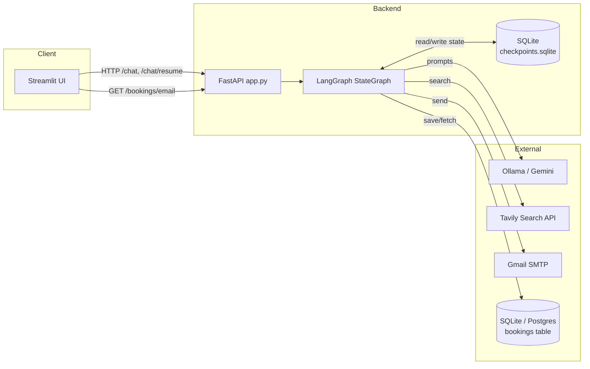
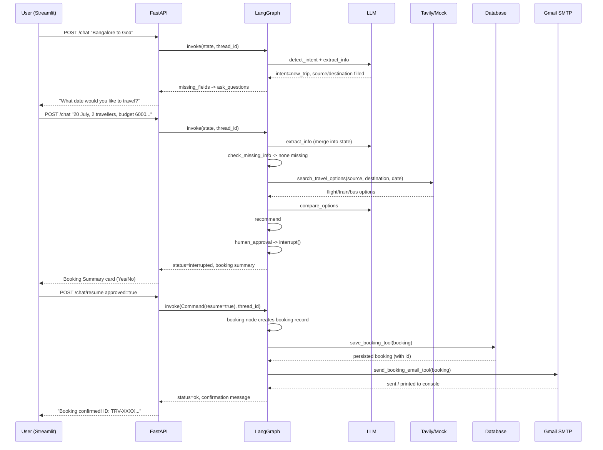

# Architecture

## 1. System architecture



## 2. LangGraph workflow

```mermaid
flowchart TD
    START([START]) --> INTENT[detect_intent]

    INTENT -- new_trip --> EXTRACT[extract_info]
    INTENT -- show_bookings --> FETCH[fetch_previous_bookings]
    INTENT -- chit_chat --> CHAT[chit_chat]

    EXTRACT --> MISSING[check_missing_info]
    MISSING -- fields missing --> ASK[ask_questions]
    MISSING -- all collected --> SEARCH[search_travel_options]

    ASK --> ENDA([END - wait for next user message])

    SEARCH --> COMPARE[compare_options]
    COMPARE --> RECOMMEND[recommend]
    RECOMMEND --> APPROVAL{{human_approval\ninterrupt()}}

    APPROVAL -- approved --> BOOK[create_booking]
    APPROVAL -- rejected --> CANCEL[cancelled]

    BOOK --> STORE[store_booking]
    STORE --> EMAIL[send_email]
    EMAIL --> CONFIRM[show_confirmation]
    CONFIRM --> ENDB([END])
    CANCEL --> ENDC([END])

    FETCH --> ENDD([END])
    CHAT --> ENDE([END])
```

## 3. Sequence diagram — full booking flow with Human-in-the-Loop



## Design notes

- **State** (`graph/state.py`) is a single `TypedDict`. `messages` uses the
  `add_messages` reducer so chat history appends instead of overwriting;
  every other field is a plain overwrite, which is enough for this app and
  easy to explain.
- **Memory = Checkpointing.** There's no separate "memory store" — the
  `SqliteSaver` checkpointer *is* the memory. Every node's return value is
  merged into state and persisted to `checkpoints/checkpoints.sqlite`,
  keyed by `thread_id`. Restoring memory and resuming after a crash are the
  same mechanism.
- **Human-in-the-loop** uses LangGraph's native `interrupt()` (see
  `graph/nodes.py::human_approval_node`). The graph execution genuinely
  pauses; `app.get_state(config).next` is non-empty until a caller resumes
  it with `Command(resume=...)`.
- **Tool calling** is deliberately explicit (`some_tool.invoke({...})`)
  rather than hidden behind an LLM tool-calling loop, so students can see
  exactly which node calls which tool with which arguments.
