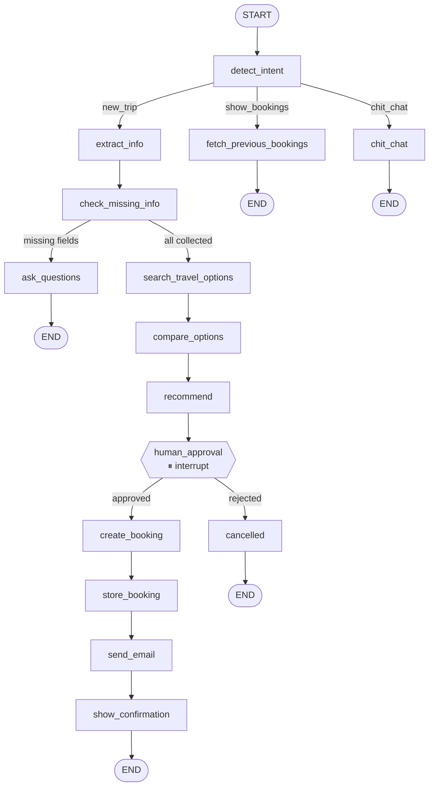
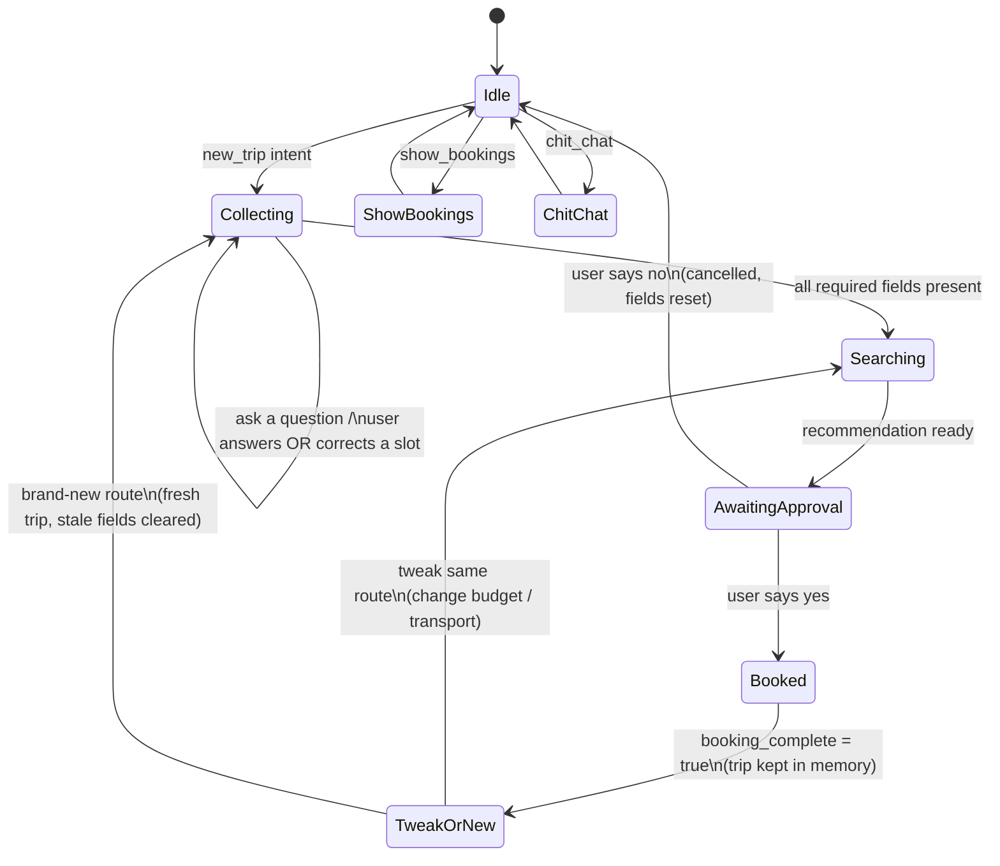
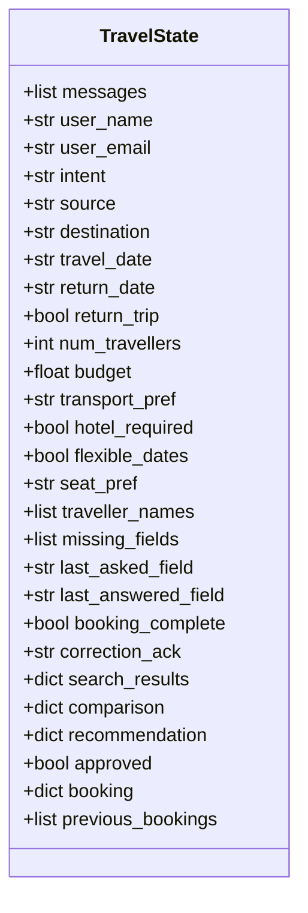
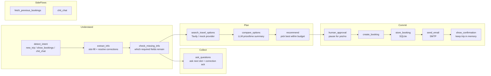
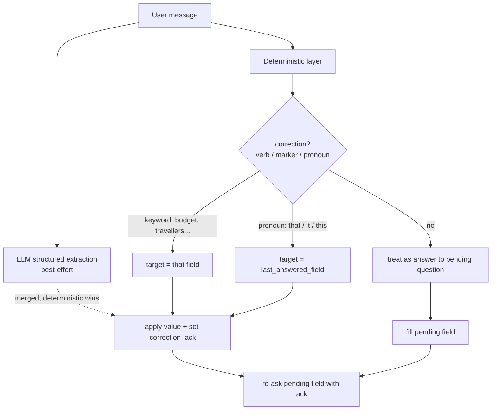

# Travel Planner — Diagrams

Copy any block below into [mermaid.live](https://mermaid.live), Excalidraw, Notion,
or a Mermaid-aware whiteboard. All diagrams reflect the current code in
`graph/graph.py`, `graph/nodes.py`, and `graph/state.py`.

---

## 1. Graph flow (LangGraph wiring)

---

## 2. Conversation lifecycle (state machine)

---

## 3. State shape (TravelState)

---

## 4. Node responsibilities

| Node | Responsibility |
|------|----------------|
| `detect_intent` | Classify message: new_trip / show_bookings / chit_chat |
| `extract_info` | Fill slots from the message; resolve corrections (incl. "change that to X") |
| `check_missing_info` | Compute `missing_fields` (adds `traveller_names` when >1 traveller) |
| `ask_questions` | Ask the next missing field; prepend correction acknowledgement |
| `search_travel_options` | Fetch flight/train/bus options (Tavily or mock) |
| `compare_options` | LLM summary of price, duration, convenience |
| `recommend` | Choose cheapest in-budget option, honoring transport preference |
| `human_approval` | `interrupt()` — pause until user approves/rejects |
| `create_booking` → `store_booking` → `send_email` → `show_confirmation` | Book, persist, email, confirm — then retain trip in memory |
| `cancelled` | Reset trip fields, end politely |
| `fetch_previous_bookings` | Read bookings from DB (no LLM) |
| `chit_chat` | Friendly reply nudging toward planning |

---

## 5. Memory & correction sub-flow (the fix)

